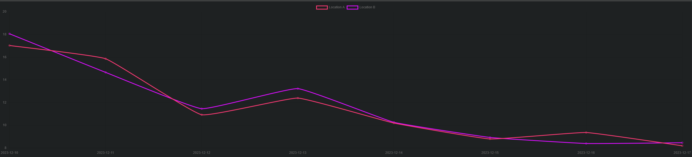

# TempMonitor

<p align="center">
  
</p>

## Inhaltverzeichnis

  - [1. Einleitung](#1-einleitung)
  - [2. Server Konfiguration](#2-server-konfiguration)
    * [2.1 Benutzer-Konfiguration](#21-benutzer-konfiguration)
      + [2.1.1 Neuen Benutzer anlegen](#211-neuen-benutzer-anlegen)
      + [2.1.2 SSH-Schlüssel-Generierung](#212-ssh-schlüssel-generierung)
      + [2.1.3 Deaktivierung der passwortbasierten Authentifizierung](#213-deaktivierung-der-passwortbasierten-authentifizierung)
    * [2.2 Domain-Konfiguration](#22-domain-konfiguration)
    * [2.3 Reverse-Proxy-Konfiguration](#23-reverse-proxy-konfiguration)
      + [2.3.1 NGINX Installation](#231-nginx-installation)
      + [2.3.2 NGINX-Erstkonfiguration](#232-nginx-erstkonfiguration)
    * [2.4 Flask und Gunicorn Anwendungsserver](#24-flask-und-gunicorn-anwendungsserver)
      + [2.4.1 Erstellung einer virtuellen Umgebung](#241-erstellung-einer-virtuellen-umgebung)
      + [2.4.2 Flask und Gunicorn Installation](#242-flask-und-gunicorn-installation)
      + [2.4.3 WSGI-Einstiegspunkt](#243-wsgi-einstiegspunkt)
      + [2.4.4 Gunicorn Konfiguration](#244-gunicorn-konfiguration)
      + [2.4.5 NGINX Konfiguration](#245-nginx-konfiguration)
    * [2.5 SSL-Zertifikat](#25-ssl-zertifikat)
      + [2.5.1 SSL-Zertifikat hochladen](#251-ssl-zertifikat-hochladen)
      + [2.5.2 NGINX SSL-Konfiguration](#252-nginx-ssl-konfiguration)
  - [3. Datenbank Einrichtung](#3-datenbank-einrichtung)
    * [3.1 MariaDB Installation](#31-mariadb-installation)
    * [3.2 MariaDB Konfiguration](#32-mariadb-konfiguration)
    * [3.3 Datenbank Tabellen](#33-datenbank-tabellen)
    * [3.4 Flask-SQLAlchemy](#34-flask-sqlalchemy)
  - [4. Programmierung](#4-programmierung)
    * [4.1 Backend](#41-backend)
      + [4.1.1 Hinzufügen einer neuen Messung](#411-hinzufügen-einer-neuen-messung)
      + [4.1.2 Anzeigen der Messungen im Browser](#412-anzeigen-der-messungen-im-browser)
      + [4.1.3 Benutzerauthentifizierung](#413-benutzerauthentifizierung)
    * [4.2 Frontend](#42-frontend)
      + [4.2.1 Diagramm](#421-diagramm)
        + [4.2.2 Filter Funktion](#422-filter-funktion)
    * [4.3 ESP32-Controller](#43-esp32-controller)
  - [5. Glossar](#5-glossar)

<!-- TOC --><a name="1-einleitung"></a>
## 1. Einleitung

Das Tempmonitor-Projekt ist eine Implementierung eines Webservers, der als [API](#API-id)-Endpunkt zum Senden von Temperatur-
und Feuchtigkeitsdaten von einem [ESP32-Mikrocontroller](#ESP32-id) dient. Der Mikrocontroller verwendet einen Sensor, um die Temperaturdaten zu lesen und führt dann [API](#API-id)-Aufrufe an den Webserver aus,
um die Daten in einen [SQL](#SQL-id)-Server zu schreiben und sie dann visuell auf der Webseite darzustellen. Diese README-Datei dient als Dokumentation des Prozesses der Konfiguration des Servers, der Installation der notwendigen Software zum Betrieb des Servers, der Programmierung des [Backends](#Backend-id) mit dem [Flask](#Flask-id)-Framework, der Programmierung des Mikrocontrollers zum
Lesen und Senden der Daten und der Programmierung des [Frontends](#Frontend-id) für die visuelle Darstellung der Daten.

<!-- TOC --><a name="2-server-konfiguration"></a>
## 2. Server Konfiguration
Der erste Schritt bestand darin, einen [virtuellen Server](#v-server-id) bei einem Hosting-Anbieter zu mieten. Wir wurden angewiesen, den Server mit der geringsten [RAM](#Ram-id)- und Festplattenkapazität zu wählen, da das Projekt nicht viel von diesen Ressourcen benötigt.

Der von mir gewählte [virtuellen Server](#v-server-id) hat die folgenden Eigenschaften:
<table>
  <tr>
    <th>Host</th>
    <td> <a href="https://www.ionos.de/">IONOS<sup>[external]</sup></a> </td>
  </tr>
  <tr>
    <th>Betriebssystem</th>
    <td>Ubuntu 22.04</td>
  </tr>
  <tr>
    <th>CPU</th>
    <td>1 vCore</td>
  </tr>
  <tr>
    <th>RAM</th>
    <td>1 GB</td>
  </tr>
  <tr>
    <th>Datenträger</th>
    <td>10 GB SSD</td>
  </tr>
</table>

Nachdem die Anmietung abgeschlossen war, erhielt ich die [Root](#Root-id)-Benutzeranmeldeinformationen für meinen V-Server.

<a name="21-benutzer-konfiguration"></a>
### 2.1 Benutzer-Konfiguration
Der Serveranbieter stellte mir ein [SSH](#ssh-id)-Passwort für den [Root](#Root-id)-Benutzer zur Verfügung. Da die Kennwortauthentifizierung anfällig für [Brute-Force-Angriffe](#Brute-force-id) ist, wurden wir angewiesen, einen [Linux](#linux-id)-Benutzer zu erstellen, der sich über [SSH-Schlüssel-basierte Authentifizierung](#key-based-auth-id) beim Server anmelden kann.

Um dies zu erreichen, mussen wir uns zunächst mit den Anmeldedaten am Server per [SSH](#ssh-id) anmelden:
```Console
pinghero@desktop:~$ ssh root@server-ip
```
Nach Eingabe des Passworts in die Eingabeaufforderung habe ich mich erfolgreich mit dem Server verbunden.

<!-- TOC --><a name="211-neuen-benutzer-anlegen"></a>
### 2.1.1 Neuen Benutzer anlegen
Nach erfolgreicher Verbindung zum Server musste ein neuer Benutzer angelegt werden.  
Dies kann mit folgendem [Linux](#linux-id)-Befehl erreicht werden:
```Console
root@ubuntu:~$ adduser <username>
```
Nachdem der Befehl ausgeführt wurde, wurde aufgefordert, ein Benutzerpassword zu erstellen. Danach wurde der neue Benutzer erstellt.

Damit der neue Benutzer administrative Befehle auf dem Server ausführen kann, benötigt er [sudo](#sudo-id)-Rechte. Zu diesem Zweck mussen wir den Benutzer zur [sudo](#sudo-id)-Benutzergruppe hinzufügen. Dazu führen wir den Befehl aus:
```Console
root@ubuntu:~$ usermod -aG sudo <username>
```
<!-- TOC --><a name="212-ssh-schlüssel-generierung"></a>
### 2.1.2 SSH-Schlüssel-Generierung
Um sicherzustellen, dass der Server gegen mögliche Angriffe geschützt ist, ist eine Authentifizierung mit [SSH](#ssh-id)-Schlüssel erforderlich.  
Dazu müssen wir zunächst ein [RSA](#rsa-id)-Schlüsselpaar auf dem Gerät erstellen, von dem aus wir eine Verbindung herstellen wollen.  
Dies kann je nach verwendetem Betriebssystem unterschiedlich sein. In meinem Fall habe ich [WSL2](#wsl-id) auf meinem Computer verwendet, um eine Verbindung zu meinem Server herzustellen

Lokal auf dem Gerät:
```Console
pinghero@desktop:~$ ssh-keygen
```
Ausgabe:
```Console
Generating public/private rsa key pair.
Enter file in which to save the key (/home/pinghero/.ssh/id_rsa):
```
Wir können den gewünschten Dateipfad für unseren [SSH](#ssh-id)-Schlüssel eingeben oder die Eingabetaste drücken, um den Standardschlüssel zu verwenden.

Wir werden dann aufgefordert, ein Passwort für unseren Schlüssel zu vergeben. Dies ist optional.
```Console
Enter passphrase (empty for no passphrase):
Enter same passphrase again:
```
Nach der Eingabe eines Passworts oder dem Weglassen des Passworts wird der Schlüssel generiert.
```Console
Your identification has been saved in /home/pinghero/.ssh/id_rsa
Your public key has been saved in /home/pinghero/.ssh/id_rsa.pub
The key fingerprint is:
SHA256:dpAQh2tQRp3skIEcli3uEKoMYQ72Iixezt+uBJOwdjI pinghero@desktop
The key's randomart image is:
+---[RSA 3072]----+
|   .oBBB..       |
|oo..*.=o+.       |
|*+.o o +o        |
|=++oo o ..       |
|BE=B .  S .      |
|oo+o+  . .       |
|    ...          |
|    .. .         |
|     .o.         |
+----[SHA256]-----+
```

Nachdem wir den [SSH](#ssh-id)-Schlüssel erfolgreich generiert haben, müssen wir ihn für unseren neuen Benutzer auf den Server kopieren. Dazu können wir das tool ```ssh-copy-id``` verwenden, das in den meisten [Linux](#linux-id)-Distributions standardmäßig enthalten ist.

Um das Dienstprogramm ssh-copy-id zu verwenden, geben wir den entfernten Host (unseren Server) und den Benutzer an, zu dem wir passwortbasierten [SSH](#ssh-id)-Zugang haben.

```Console
pinghero@desktop:~$ ssh-copy-id username@server-ip
```

Daraufhin wird folgende Meldung angezeigt:
```Console
Output
The authenticity of host 'server-ip (server-ip)' can't be established.
ECDSA key fingerprint is fd:fd:d4:f9:77:fe:73:84:e1:55:00:ad:d6:6d:22:fe.
Are you sure you want to continue connecting (yes/no)? yes
```
Das bedeutet, dass unser lokales System den Server nicht erkennt. Durch die Eingabe von ```yes``` entscheiden wir uns, diesem Server zu vertrauen.

Ausgabe:

```Console
Output
/usr/bin/ssh-copy-id: INFO: attempting to log in with the new key(s), to filter out any that are already installed
/usr/bin/ssh-copy-id: INFO: 1 key(s) remain to be installed -- if you are prompted now it is to install the new keys
username@203.0.113.1's password:
```

Nach der Eingabe des neuen Benutzerkennworts erhalten wir die folgende Meldung:
```Console
Number of key(s) added: 1

Now try logging into the machine, with:   "ssh 'username@server-ip'"
and check to make sure that only the key(s) you wanted were added.
```

Das bedeutet, dass wir unseren Schlüssel erfolgreich kopiert haben und uns nun mit ihm anmelden können.

<!-- TOC --><a name="213-deaktivierung-der-passwortbasierten-authentifizierung"></a>
### 2.1.3 Deaktivierung der passwortbasierten Authentifizierung
Obwohl wir einen [SSH](#ssh-id)-Schlüssel für unseren neuen Benutzer konfiguriert haben,
ist eine passwortbasierte Authentifizierung weiterhin möglich. Um sie zu deaktivieren, müssen wir uns zunächst mit unserem Server verbinden und die [SSH](#ssh-id)-Konfigurationsdatei bearbeiten.

Um die [SSH](#ssh-id)-Konfigurationsdatei zu öffnen:
```Console
<username>@ubuntu:~$ vim /etc/ssh/sshd_config
```
Dann müssen wir die Option ```PasswordAuthentication``` auf ```no``` ändern.  
Da wir nun einen neuen Benutzer haben, der sich mit dem Server verbinden kann und [sudo](#sudo-id)-Rechte hat, können wir den [Root](#Root-id)-Authentifizierung komplett deaktivieren, um unseren Server weiter vor möglichen Angriffen zu schützen. Zu diesem Zweck ändern wir ```PermitRootLogin``` auch auf ```no```.   
Damit die Änderungen durchgeführt werden können, starten wir den [SSH](#ssh-id)-Dienst neu mit ```sudo systemctl restart ssh```.  
Jetzt können wir uns nur noch mit unserem Benutzer und dem generierten [SSH](#ssh-id)-Schlüssel verbinden.

<!-- TOC --><a name="22-domain-konfiguration"></a>
### 2.2 Domain-Konfiguration
Jetzt kann unser Server von einem Browser über seine [IP-Adresse](#ipaddr-id) erreicht werden. Wir können das ändern, indem wir die [IP-Adresse](#ipaddr-id) mit einem Domänennamen verknüpfen. Dazu müssen wir die [DNS](#dns-id)-Einträge ändern. Dies ist je nach Anbieter unterschiedlich, aber in der Regel hat der Anbieter eine Webseite mit [DNS](#dns-id)-Einstellungen. Dort müssen wir die A-Einträge so ändern, dass sie auf unsere Server-[IP-Adresse](#ipaddr-id) verweisen.

<!-- TOC --><a name="23-reverse-proxy-konfiguration"></a>
### 2.3 Reverse-Proxy-Konfiguration
Um unseren Server dem Internet auszusetzen und später die verschiedenen [HTTP](#http-id)-Anfragen, die wir erhalten, weiterzuleiten, verwenden wir eine [Reverse Proxy](#reverse-proxy-id)-Lösung.

In meinem Fall habe ich mich für [NGINX](#nginx-id) entschieden, einen beliebten Webserver und [Reverse Proxy](#reverse-proxy-id) Lösung.

<!-- TOC --><a name="231-nginx-installation"></a>
### 2.3.1 NGINX Installation
Als erstes müssen wir [NGINX](#nginx-id) auf unserem Server installieren:
```Console
pinghero@ubuntu:~$ sudo apt install nginx
```

So überprüfen Sie, ob [NGINX](#nginx-id) installiert ist und läuft:
```Console
pinghero@ubuntu:~$ sudo systemctl status nginx
```
Ausgabe:
```Console
Output
● nginx.service - A high performance web server and a reverse proxy server
     Loaded: loaded (/lib/systemd/system/nginx.service; enabled; vendor preset: enabled)
     Active: active (running) since Mon 2022-08-29 06:52:46 UTC; 39min ago
       Docs: man:nginx(8)
   Main PID: 9919 (nginx)
      Tasks: 2 (limit: 2327)
     Memory: 2.9M
        CPU: 50ms
     CGroup: /system.slice/nginx.service
             ├─9919 "nginx: master process /usr/sbin/nginx -g daemon on; master_process on;"
             └─9920 "nginx: worker process
```

<!-- TOC --><a name="232-nginx-erstkonfiguration"></a>
### 2.3.2 NGINX-Erstkonfiguration
Wir müssen einen benutzerdefinierten Serverblock mit unserer Domain und dem Proxy für den Anwendungsserver hinzufügen.  
Damit wird [NGINX](#nginx-id) im Wesentlichen mitgeteilt, welche Ports es abhören und welche Webseiten es bei einer Anfrage bereitstellen soll.

Zu diesem Zweck erstellen wir eine neue Konfigurationsdatei für [NGINX](#nginx-id):
```Console
pinghero@ubuntu:~$ sudo vim /etc/nginx/sites-available/tempmonitor
```

Dann fügen wir Folgendes in die Datei ein:
```Console
server {
    listen 80;
    listen [::]:80;

    server_name pinghero.online www.pinghero.online;
        
    location / {
        proxy_pass http://127.0.0.1:8000;
        include proxy_params;
    }
}
```
Dadurch wird [NGINX](#nginx-id) angewiesen, Port 80 ([HTTP](#http-id)-Port) abzuhören und an localhost weiterzuleiten. Da das [HTTP](#http-id)-Protokoll unverschlüsselt ist, müssen wir ein [SSL-Zertifikat](#ssl-id) hinzufügen, um die [HTTPS](#https-id)-Kommunikation zu ermöglichen. Dies wird später erklärt unter [2.5 SSL-Zertifikat](#25-ssl-zertifikat).

Wir sollten [NGINX](#nginx-id) auch anweisen, die Anfragen an unsere Anwendung statt an localhost weiterzuleiten. Dies wird auch später unter [2.4.5 NGINX Konfiguration](#245-nginx-konfiguration) erklärt.

Schließlich müssen wir eine Verknüpfung zwischen der Konfigurationsdatei und der Datei ```sites-enabled``` herstellen, die [NGINX](#nginx-id) beim Start liest:
```Console
pinghero@ubuntu:~$ sudo ln -s /etc/nginx/sites-available/tempmonitor /etc/nginx/sites-enabled/
```
Und den [NGINX](#nginx-id)-Dienst neu starten:
```Console
pinghero@ubuntu:~$ sudo systemctl restart nginx
```

<!-- TOC --><a name="24-flask-und-gunicorn-anwendungsserver"></a>
### 2.4 Flask und Gunicorn Anwendungsserver
Unser [Backend](#Backend-id) wird mit [Python](#python-id) und insbesondere mit dem [Flask](#Flask-id)-Framework verwaltet. Um dies zu erreichen, müssen wir [Flask](#Flask-id) auf unserem Server installieren, um eine Anwendung zu erstellen und [Gunicorn](#gunicorn-id), einen Python [WSGI HTTP](#wsgi-id) Server, zu konfigurieren, der unsere Anwendung bedient.

<!-- TOC --><a name="241-erstellung-einer-virtuellen-umgebung"></a>
### 2.4.1 Erstellung einer virtuellen Umgebung
Da [Python](#python-id) und [pip](#pip-id) bereits installiert sind, müssen wir eine virtuelle Umgebung erstellen, in der wir alle notwendigen Pakete für unsere Anwendung, einschließlich [Flask](#Flask-id), installieren werden.

Zunächst müssen wir das Modul ```python-venv``` installieren. Um dies zu tun:
```Console
pinghero@ubuntu:~$ sudo apt install python3-venv
```
Nachdem die Installation abgeschlossen ist, erstellen wir ein Verzeichnis für unsere [Flask](#Flask-id)-Anwendung:
```Console
pinghero@ubuntu:~$ mkdir ~/tempmonitor
pinghero@ubuntu:~$ cd ~/tempmonitor
```

Innerhalb des neu erstellten Verzeichnisses erstellen wir dann eine virtuelle Umgebung mit der Name ```venv```:
```Console
pinghero@ubuntu:~$ python3 -m venv venv
```

Und aktivieren sie mit:
```Console
pinghero@ubuntu:~$ source myprojectenv/bin/activate
```

Ausgabe:
```Console
(venv) pinghero@ubuntu:~$
```
Das ```venv``` am Anfang bestätigt, dass wir uns in einer virtuellen Umgebung befinden und wir können mit der Installation aller notwendigen Pakete beginnen.

<!-- TOC --><a name="242-flask-und-gunicorn-installation"></a>
### 2.4.2 Flask und Gunicorn Installation
Als nächstes, müssen wir [Flask](#Flask-id) und Gunicorn installieren:
```Console
(venv) pinghero@ubuntu:~$ pip install gunicorn flask
```

Nach erfolgreicher Installation werden wir eine einfache [Flask](#Flask-id)-Anwendung erstellen, die string "Hello World" zurückgibt:
```Console
(venv) pinghero@ubuntu:~$ vim /tempmonitor/flaskapp.py
```
In [flaskapp.py](flaskapp.py):
```Python filename="flaskapp.py"
from flask import Flask
app = Flask(__name__)

@app.route("/")
def hello():
    return "Hello World!"

if __name__ == "__main__":
    app.run(host='0.0.0.0')

```
Um unsere App zu testen:
```Console
(venv) pinghero@ubuntu:~$ python flaskapp.py
```

Wenn wir unsere Website in einem Webbrowser mit ```http://server-ip:5000```, sollten wir ```Hello World!``` sehen.

<!-- TOC --><a name="243-wsgi-einstiegspunkt"></a>
### 2.4.3 WSGI-Einstiegspunkt
Als nächstes müssen wir eine [WSGI](#wsgi-id)-Datei erstellen. Diese wird Gunicorn (unserem Webserver) mitteilen, wie er mit unserer Anwendung interagieren soll.

Wir erstellen eine Datei namens [wsgi.py](wsgi.py) in unserem Anwendungsordner.
```Console
(venv) pinghero@ubuntu:~$ vim ~/tempmonitor/wsgi.py
```
In [wsgi.py](wsgi.py):
```Python
from myproject import app

if __name__ == "__main__":
    app.run()
```
<!-- TOC --><a name="244-gunicorn-konfiguration"></a>
### 2.4.4 Gunicorn Konfiguration
Anschließend müssen wir einen Systemprozess für [Gunicorn](#gunicorn-id) erstellen. Dies ermöglicht es unserem Betriebssystem, [Gunicorn](#gunicorn-id) automatisch zu starten und unsere [Flask](#Flask-id)-Anwendung zu bedienen, sobald der Server neu gestartet wird.

Um einen Systemprozess zu erstellen:
```Console
pinghero@ubuntu:~$ sudo vim /etc/systemd/system/tempmonitor.service
```
In ```/etc/systemd/system/tempmonitor.service```:
```Console
[Unit]
Description=Gunicorn instance to serve tempmonitor
After=network.target

[Service]
User=pinghero
Group=www-data
WorkingDirectory=/home/pinghero/tempmonitor
Environment="PATH=/home/pinghero/tempmonitor/venv/bin"
ExecStart=/home/pinghero/tempmonitor/venv/bin/gunicorn --workers 3 --bind unix:tempmonitor.sock -m 007 wsgi:app

[Install]
WantedBy=multi-user.target
```

Dies teilt dem System den Pfad unserer virtuellen Umgebung, den Pfad unserer Anwendung, den Pfad von gunicorn und die Parameter mit, mit denen [Gunicorn](#gunicorn-id) ausgeführt werden soll.  
Dann starten wir den Prozess mit:
```Console
pinghero@ubuntu:~$ sudo systemctl start myproject
pinghero@ubuntu:~$ sudo systemctl enable myproject
```
<!-- TOC --><a name="245-nginx-konfiguration"></a>
### 2.4.5 NGINX Konfiguration
[Gunicorn](#gunicorn-id) läuft nun als Prozess und wartet auf Anfragen an die socket ```tempmonitor.sock```. Wir müssen nun [NGINX](#nginx-id) so konfigurieren, dass es eingehende Anfragen an diese socket weiterleitet, damit sie an unsere Anwendung weitergeleitet werden können.

In ```/etc/nginx/sites-available/tempmonitor```:
```Console
server {
    listen 80;
    server_name pinghero.online www.pinghero.online;

    location / {
        include proxy_params;
        proxy_pass http://unix:/home/pinghero/tempmonitor/tempmonitor.sock;
    }
}
```
Und wir starten den Server neu:
```Console
pinghero@ubuntu:~$ sudo systemctl restart nginx
```
Zusätzlich sollten wir die Firewall-Konfiguration so ändern, dass sie vollen Zugriff auf [NGINX](#nginx-id) erlaubt:
```Console
pinghero@ubuntu:~$ sudo ufw allow 'Nginx Full'
```
Wenn wir nun den Browser öffnen und unsere URL eingeben, sollten wir die String ```"Hello World!"``` sehen.

<!-- TOC --><a name="25-ssl-zertifikat"></a>
### 2.5 SSL-Zertifikat
Unser Webserver ist jetzt betriebsbereit. Er leitet den Webverkehr zu unserer [Flask](#Flask-id)-Anwendung um. Dies geschieht jedoch über das [HTTP](#http-id)-Protokoll, das nicht verschlüsselt ist. Das ist natürlich suboptimal, da die Kommunikation von und zu unserem Server anfällig für Angriffe ist. Um dieses Problem zu lösen, müssen wir ein [SSL-Zertifikat](#ssl-id) von einer [Zertifizierungsstelle (CA)](#ca-id) erhalten.
In meinem Fall ist dies <a href="https://www.digicert.com/">DigiCert<sup>[external]</sup></a>.

<!-- TOC --><a name="251-ssl-zertifikat-hochladen"></a>
### 2.5.1 SSL-Zertifikat hochladen
Nachdem mein Zertifikat ausgestellt wurde, erhielt ich eine Datei namens ```pinghero.pem```
Als die Zertifikate ausgestellt wurden, erhielt ich drei Dateien: ```pinghero.pem``` und ```DigiCertCA.crt```. Die sind die so genante "primary" und "intermidiate" Zertifikate.  
Zusätzlich habe ich eine private Schlüsseldatei namens ```_.pinghero.online_private_key.key```.  
Nachdem ich die Dateien erhalten habe, habe ich lokal auf mein Computer eine einzige ```.crt``` Datei erstellt, die beide Zertifikate enthält:
```Console
pinghero@desktop:~$ cat your_domain_name.crt DigiCertCA.crt >> bundle.crt
```
Und auf meinen Server hochgeladen:
```Console
pinghero@desktop:~$ sftp pinghero@server-ip
sftp> cd /etc/ssl/
sftp> put bundle.crt
sftp> _.pinghero.online_private_key.key
```

<!-- TOC --><a name="252-nginx-ssl-konfiguration"></a>
### 2.5.2 NGINX SSL-Konfiguration
Nach dem erfolgreichen Hochladen des [SSL-Zertifikats](#ssl-id) und meines privaten Schlüssels, müssen wir [NGINX](#nginx-id) für dessen Verwendung konfigurieren.

In ```/etc/nginx/sites-enabled/tempmonitor```:
```Console
server {
listen 443;
ssl on;
ssl_certificate /etc/ssl/bundle.crt;
ssl_certificate_key /etc/ssl/_.pinghero.online_private_key.key;
ssl_protocols TLSv1 TLSv1.1 TLSv1.2;
server_name pinghero.online www.pinghero.online;

      location / {
        include proxy_params;
        proxy_pass http://unix:/home/pinghero/tempmonitor/flaskapp.sock;
    }
}
```
Dadurch wird [NGINX](#nginx-id) angewiesen, Port 443 ([HTTPS](#https-id)-Port) zu überwachen und unser Zertifikat zu verwenden.

Außerdem sollten wir sicherstellen, dass nur [HTTPS](#https-id)-Verkehr zugelassen wird.

In ```/etc/nginx/sites-enabled/default```:
```Console
server {
    listen 80 default_server;

    server_name _;

    return 301 https://$host$request_uri;
}
```

Dadurch wird für jede [HTTP](#http-id)-Anfrage auf unserem Server der "[HTTP](#http-id) code 301" zurückgegeben.

<!-- TOC --><a name="3-datenbank-einrichtung"></a>
## 3. Datenbank Einrichtung
Um unsere Temperaturmessungen auf unserem Server speichern zu können, benötigen wir eine Datenbank. Es gibt viele [SQL](#SQL-id) Server-Optionen, aber ich habe mich für [MariaDB](#mariadb-id) entschieden.

<!-- TOC --><a name="31-mariadb-installation"></a>
### 3.1 MariaDB Installation
Um [MariaDB Server](#mariadb-id) zu installieren:
```Console
pinghero@ubuntu:~$ sudo apt install mariadb-server
```
Dann müssen wir den Server mit dem Befehl starten:
```Console
pinghero@ubuntu:~$ sudo systemctl start mariadb.service
```

<!-- TOC --><a name="32-mariadb-konfiguration"></a>
### 3.2 MariaDB Konfiguration
[MariaDB](#mariadb-id) läuft jetzt, aber diese Befehle fordern den Benutzer nicht auf, ein Passwort zu erstellen oder die Konfiguration von MariaDB zu bearbeiten, die standardmäßig unsicher ist.  
Um dies zu verhindern, müssen wir das Skript ```mysql_secure_installation``` ausführen:
```Console
pinghero@ubuntu:~$ sudo mysql_secure_installation
```
Das Skript fordert unter anderem die Konfiguration des Passworts für den [Root](#Root-id)-Benutzer und die Konfiguration des Fernzugriffs an.
Weitere Informationen über das Skript finden Sie <a href="https://dev.mysql.com/doc/refman/8.0/en/mysql-secure-installation.html">hier</a>.

<!-- TOC --><a name="33-datenbank-tabellen"></a>
### 3.3 Datenbank Tabellen
Die Datenbank hat zwei Tabellen: ```measurements``` und ```users```.

Die Tabelle ```measurements``` hat die folgenden Spalten:
- ID (Primärschlüssel)
- Temperature
- Humidity
- Location

Befehl ```CREATE TABLE```:
```SQL
CREATE TABLE measurments(ID MEDIUMINT UNSIGNED NOT NULL AUTO_INCREMENT UNIQUE, TEMPERATURE FLOAT, HUMIDITY FLOAT, LOCATION CHAR(50), CREATED_ON TIMESTAMP NOT NULL DEFAULT CURRENT_TIMESTAMP);
```
Die Tabelle ```users``` hat die folgenden Spalten:
- Username (Primärschlüssel)
- [Salt](#salt-id)
- Pwd_hash

Befehl ```CREATE TABLE```:
```SQL
CREATE TABLE users(username CHAR(15) NOT NULL UNIQUE, SALT BINARY(32), PWD_HASH BINARY(32));
```

<!-- TOC --><a name="34-flask-sqlalchemy"></a>
### 3.4 Flask-SQLAlchemy
Für die Kommunikation zwischen [Python](#python-id) und der Datenbank wird Flask-SQLAlchemy benötigt.  
SQLAlchemy ist ein [SQL](#SQL-id)-Toolkit, das effizienten und leistungsstarken Datenbankzugriff für relationale Datenbanken bietet.

SQLAlchemy ist in der [db_models.py](database/db_models.py) instanziert. Dann wird es initialisiert in [flaskapp.py](flaskapp.py)
Es werden auch zwei Klassen für die Datenbanktabellen definiert: ```measurements``` and ```users```.
Die sind nach den Datenbanktabellen modelliert. Mit diesen beiden Klassen und der Instanz von SQLAlchemy können wir in der Datenbank lesen oder schreiben.

Alle Datenbankzugriffsoperationen erfolgen in [dao.py](dao.py)

<!-- TOC --><a name="4-programmierung"></a>
## 4. Programmierung

<!-- TOC --><a name="41-backend"></a>
### 4.1 Backend
Es gibt 2 Hauptfunktionen, die der Server erfüllen kann. Diese sind:
- Hinzufügen einer neuen Messung [add_measurment()](route_functions.py)
- Anzeigen der Messungen im Browser [show_measurements()](route_functions.py)

Zusätzlich gibt es weitere Hilfsfunktionen für:
- Benutzerauthentifizierung [verify_password.py](verify_password.py)
- Datenbank kommunikation mit Python [dao.py](dao.py)

<!-- TOC --><a name="411-hinzufügen-einer-neuen-messung"></a>
### 4.1.1 Hinzufügen einer neuen Messung
Damit der [ESP32-Mikrocontroller](#ESP32-id) eine neue Messung senden kann, wird eine [POST](#post-id)-Anfrage an die ```pinghero.online/add``` Route unseres Servers gesendet. Wie der ESP Controller diese Anfragen sendet, wird in [4.3 ESP32-Controller](#43-esp32-controller) beschrieben. Das [Backend](#Backend-id) erwartet [JSON](#json-id)-Daten, die die folgende Struktur haben:
```JSON
{
  "temperature": "20.1",
  "humidity":"67.3",
  "location":"Location A"
}
```
Wenn die Benutzerauthentifizierung (Siehe [4.1.3 Benutzerauthentifizierung](#413-benutzerauthentifizierung)) erfolgreich war und die Daten die richtige Struktur haben, wird die neue Messung in die Datenbank geschrieben.

<!-- TOC --><a name="412-anzeigen-der-messungen-im-browser"></a>
### 4.1.2 Anzeigen der Messungen im Browser
Wenn der Benutzer ```pinghero.online``` besucht, wird er mit einer Tabelle aller in der Datenbank verfügbaren Messungen begrüßt.  
Die Daten werden zunächst aus der Datenbank gelesen. Sie werden an die [HTML](#html-id)-Datei [measurements.html](templates/measurements.html) übergeben. Dort wird mittels [Javascript](#js-id)-Code eine Tabelle dynamisch erzeugt. Wenn der Benutzer es wünscht, kann er die Daten sortieren oder Suchparameter anwenden (Siehe [4.2.2 Filter Funktion](#422-filter-funktion)).


<!-- TOC --><a name="413-benutzerauthentifizierung"></a>
### 4.1.3 Benutzerauthentifizierung
Die Benutzerdaten werden in der Tabelle ```users``` gespeichert. Wenn eine neue Anfrage eine Autorisierung erfordert, wird der in der "Request header" der Anfrage angegebene Benutzername gelesen und eine Abfrage in der ```users``` Tabelle durchgeführt. (Siehe [verify_password.py](verify_password.py))

Wenn ein Benutzer mit dem angegebenen Benutzernamen existiert, wird ein Hashwert mit dem angegebenen Passwort und dem aus der Datenbank gelesenen [Salt](#salt-id)-Wert erzeugt.

```Python
generated_hash = hashlib.sha256(user.salt.encode() + password.encode()).hexdigest()
```
Wenn der generierte Passwort-Hash mit dem in der Benutzertabelle für diesen Benutzer gespeicherten Hash übereinstimmt, wird ihm der Zugang gewährt.

<!-- TOC --><a name="42-frontend"></a>
### 4.2 Frontend
Die Daten werden auf dem [Frontend](#Frontend-id) auf zwei Arten dargestellt:
- Ein Diagramm, das die durchschnittliche Temperatur jedes Tages für die Messungen der letzten 10 Tage enthält.
- Eine Tabelle, die sich aus einzelnen Messungen zusammensetzt.

Zu den zusätzlichen Funktionen gehören:
- Filter-Buttons, die angeklickt werden können, um Eingabefelder für die Filterung der einzelnen Messattribute zu öffnen.
- Sort-Buttons built on the table headers.

<!-- TOC --><a name="421-diagramm"></a>
### 4.2.1 Diagramm
<p align="center">
  
</p>  

Der Graph wird mit Hilfe der [Javascript](#js-id)-Bibliothek <a href="https://www.chartjs.org/">Chart.js<sup>[external]</sup></a> erstellt.  

Der Quellcode ist zu finden in [measurements.html](templates/measurements.html).

<!-- TOC --><a name="422-filter-funktion"></a>
### 4.2.2 Filter Funktion
<p align="center">
  
</p>
Es gibt vier Tasten für die Filterfunktion. Jede, wenn sie angeklickt wird, offenbart Eingabefelder für Temperatur, Luftfeuchtigkeit, Ort und Datum.  

Wenn die Filter angewendet werden, wird ein [AJAX](#ajax-id)-Aufruf der Route ```/get_filtered_table_data``` ausgeführt. (Siehe [filter_data.js](static/js/filter_data.js))  
Dann führt [Flask](#Flask-id) eine Datenbankabfrage basierend auf den vom Benutzer angegebenen Filtern aus. (Siehe [get_filtered_data](dao.py))  
Die Messdaten werden dann in [JSON](#json-id) umgewandelt und an das [Frontend](#Frontend-id) zurückgegeben, wo die Tabelle dynamisch aktualisiert wird.

<!-- TOC --><a name="43-esp32-controller"></a>
### 4.3 ESP32-Controller
[read_temps.ino](esp/read_temps.ino)

Das ESP-Controller liest die Temperaturdaten mit Hilfe der ```DHT.h``` Bibliothek. Dann stellt es eine Verbindung mit dem im Code angegebenen WLAN her und erstellt [JSON](json-id)-Daten mit der oben genannten Struktur. Anschließend sendet es die [JSON](json-id)-Daten mit dem ebenfalls im Code angegebenen Basic Authentication Header und wartet 5 Sekunden, bevor es den Vorgang wiederholt.

<p id="unique-id"></p>

## 5. Glossar
| Begriff                                                                | Kurzbeschreibung                                                                                                                                                                                                                                                                                                                                                                                                                                                                                                                       | Quelle                                                                                                          |
|------------------------------------------------------------------------|----------------------------------------------------------------------------------------------------------------------------------------------------------------------------------------------------------------------------------------------------------------------------------------------------------------------------------------------------------------------------------------------------------------------------------------------------------------------------------------------------------------------------------------|-----------------------------------------------------------------------------------------------------------------|
| <p id="API-id">API</p>                                                 | Eine API (Application Programming Interface) ist ein Satz von Befehlen, Funktionen, Protokollen und Objekten, die Programmierer verwenden können, um eine Software zu erstellen oder mit einem externen System zu interagieren.                                                                                                                                                                                                                                                                                                        | <a href="https://www.talend.com/de/resources/was-ist-eine-api/">talend.com</a>                                  |
| <p id="ESP32-id">ESP32 Microcontroller</p>                             | Der ESP32 ist eine kostengünstige und mit geringem Leistungsbedarf ausgeführte 32-Bit-Mikrocontrollerfamilie der chinesischen Firma Espressif, die im Jahr 2016 vorgestellt wurde. Die Mikrocontroller ermöglichen durch ihre offene Bauweise den Aufbau und die Vernetzung von netzwerkbasierten Aktuatoren und Sensoren.                                                                                                                                                                                                             | <a href="https://de.wikipedia.org/wiki/ESP32">wikipedia.org</a>                                                 |
| <p id="SQL-id">SQL</p>                                                 | Structured Query Language (SQL) ist eine Programmiersprache zum Speichern und Verarbeiten von Informationen in einer relationalen Datenbank. Eine relationale Datenbank speichert Informationen in tabellarischer Form, wobei Zeilen und Spalten verschiedene Datenattribute und die verschiedenen Beziehungen zwischen den Datenwerten darstellen                                                                                                                                                                                     | <a href="https://aws.amazon.com/de/what-is/sql/">aws.amazon.com</a>                                             |
| <p id="Backend-id">Backend</p>                                         | Als Backend (auch Back End oder Back-End geschrieben) wird der Teil eines Programms bezeichnet, der sich im Hintergrund abspielt und somit für den Benutzer unsichtbar ist.                                                                                                                                                                                                                                                                                                                                                            | <a href="https://dev-supp.de/programmierung/frontend-vs-backend">dev-supp.de</a>                                |
| <p id="Flask-id">Flask</p>                                             | Flask ist ein schlankes Mikro-Webframework zum Programmieren von Webanwendungen mit Python.                                                                                                                                                                                                                                                                                                                                                                                                                                            | <a href="https://www.bigdata-insider.de/was-ist-flask-a-994166/">bigdata-insider.de</a>                         |
| <p id="Frontend-id">Frontend</p>                                       | Als Frontend wird die so genannte Präsentationsebene bezeichnet – also der Teil einer Software-Anwendung oder anderen Applikation wie beispielsweise einer Webseite, der für den Betrachter sichtbar ist (grafische Benutzeroberfläche).                                                                                                                                                                                                                                                                                               | <a href="https://it-service.network/it-lexikon/frontend">it-service.network</a>                                 |
| <p id="Ram-id">RAM</p>                                                 | Der RAM (Random Access Memory) bildet das Kurzzeitgedächtnis Ihres Computers, in dem die Daten, die der Prozessor gerade verwendet, gespeichert werden.                                                                                                                                                                                                                                                                                                                                                                                | <a href="https://www.avast.com/de-de/c-what-is-ram-memory">avast.com</a>                                        |
| <p id="v-server-id">Virtuelle Server oder V-Server</p>                 | Ein virtueller Server erstellt die Funktionalität eines dedizierten physischen Servers neu. Er ist transparent für Nutzer als partitionierter Bereich auf einem physischen Server vorhanden. Durch die Virtualisierung der Server ist es einfach, Ressourcen neu zuzuweisen und an dynamische Arbeitslasten anzupassen.                                                                                                                                                                                                                | <a href="https://cloud.google.com/learn/what-is-a-virtual-server?hl=de">cloud.google.com</a>                    |
| <p id="Root-id">Root Konto</p>                                         | Das Root-Konto oder Superuser-Konto ist das Benutzerkonto, das bei der Installation eines Betriebssystems angelegt werden muss und mit weitreichendsten Zugriffsrechten ausgestattet ist.                                                                                                                                                                                                                                                                                                                                              | <a href="https://de.wikipedia.org/wiki/Root-Konto">wikipedia.org</a>                                            |
| <p id="Brute-Force-id">Brute-Force-Angriffe</p>                        | Bei einem Brute-Force-Angriff handelt es sich um eine Methode, die versucht Passwörter oder Schlüssel durch automatisiertes, wahlloses Ausprobieren herauszufinden.                                                                                                                                                                                                                                                                                                                                                                    | <a href="https://www.security-insider.de/was-ist-ein-brute-force-angriff-a-677192/">security-insider.de</a>     |
| <p id="Linux-id">Linux</p>                                             | Linux® ist ein Open Source-Betriebssystem. Unter einem Betriebssystem versteht man die Software, von der die Hardware und Systemressourcen, wie CPU, Speicher und Storage, direkt verwaltet werden.                                                                                                                                                                                                                                                                                                                                    | <a href="https://www.redhat.com/de/topics/linux/what-is-linux">redhat.com</a>                                   |
| <p id="ssh-id">SSH</p>                                                 | SSH steht für Secure Shell und ist ein Netzwerkprotokoll, das seinen Nutzern beim Zugriff auf andere Netzwerkrechner in ungesicherten Netzwerken besondere Sicherheits-Features bietet.                                                                                                                                                                                                                                                                                                                                                | <a href="https://www.heise.de/tipps-tricks/Was-ist-SSH-7313396.html">heise.de</a>                               |
| <p id="key-based-auth-id">SSH-Schlüssel-basierte Authentifizierung</p> | Die schlüsselbasierte SSH-Authentifizierung nutzt die asymmetrische Verschlüsselung mit einem öffentlichen Schlüsseln (public key), um eine zusätzliche Sicherheitsebene für den Fernzugriff auf das System zu schaffen.                                                                                                                                                                                                                                                                                                               | <a href="https://devstorage.eu/blog/ssh-schluessel-authentifizierung-in-linux/">devstorage.eu</a>               |
| <p id="sudo-id">sudo</p>                                               | sudo ist ein Befehl unter Unix und unixartigen Betriebssystemen wie Linux oder macOS, der dazu benutzt wird, Prozesse mit den Rechten eines anderen Benutzers (z. B. des Superusers root) zu starten.                                                                                                                                                                                                                                                                                                                                  | <a href="https://de.wikipedia.org/wiki/Sudo">wikipedia.org</a>                                                  |
| <p id="rsa-id">RSA</p>                                                 | RSA (Rivest–Shamir–Adleman) ist ein asymmetrisches kryptographisches Verfahren, das sowohl zum Verschlüsseln als auch zum digitalen Signieren verwendet werden kann.[1] Es verwendet ein Schlüsselpaar, bestehend aus einem privaten Schlüssel, der zum Entschlüsseln oder Signieren von Daten verwendet wird, und einem öffentlichen Schlüssel, mit dem man verschlüsselt oder Signaturen prüft. Der private Schlüssel wird geheim gehalten und kann nicht mit realistischem Aufwand aus dem öffentlichen Schlüssel berechnet werden. | <a href="https://de.wikipedia.org/wiki/RSA-Kryptosystem">wikipedia.org</a>                                      |
| <p id="wsl-id">WSL</p>                                                 | Windows-Subsystem für Linux (WSL) ist ein Feature von Windows, mit dem Sie eine Linux-Umgebung auf Ihrem Windows-Computer ausführen können, ohne dass ein separater virtueller Computer oder dualer Start erforderlich ist.                                                                                                                                                                                                                                                                                                            | <a href="https://learn.microsoft.com/de-de/windows/wsl/about">learn.microsoft.com</a>                           |
| <p id="ipaddr-id">IP-Adresse</p>                                       | Eine IP-Adresse ist eine Adresse in Computernetzen, die – wie das Internet – auf dem Internetprotokoll (IP) basieren. Sie wird Geräten zugewiesen, die an das Netz angebunden sind, macht die Geräte so adressierbar und damit erreichbar.                                                                                                                                                                                                                                                                                             | <a href="https://de.wikipedia.org/wiki/IP-Adresse">wikipedia.org</a>                                            |
| <p id="dns-id">DNS</p>                                                 | Das Domain Name System (DNS) ist das Telefonbuch des Internets. Menschen greifen über Domain-Namen wie nytimes.com oder espn.com auf Online-Informationen zu. Webbrowser verwenden IP-Adressen (Internet Protocol) zur Interaktion. Das DNS übersetzt Domain-Namen in IP-Adressen, damit Browser Internetressourcen laden können.                                                                                                                                                                                                      | <a href="https://www.cloudflare.com/de-de/learning/dns/what-is-dns/">cloudflare.com</a>                         |
| <p id="http-id">HTTP</p>                                               | HTTP steht für Hypertext Transfer Protocol. Mithilfe dieses Protokolls lassen sich Daten in einem Netzwerk übertragen. Die wichtigste Verwendung des HTTP ist die Darstellung von Internetseiten. Ohne das Protokoll könnte man keine Webseite aufrufen.                                                                                                                                                                                                                                                                               | <a href="https://www.heise.de/tipps-tricks/HTTP-was-ist-das-4607102.html">heise.de</a>                          |
| <p id="https-id">HTTPS</p>                                             | Hypertext Transfer Protocol Secure (HTTPS, englisch für „sicheres Hypertext-Übertragungsprotokoll“) ist ein Kommunikationsprotokoll im World Wide Web, mit dem Daten abhörsicher übertragen werden können. Es stellt eine Transportverschlüsselung dar.                                                                                                                                                                                                                                                                                | <a href="https://de.wikipedia.org/wiki/Hypertext_Transfer_Protocol_Secure">wikipedia.org</a>                    |
| <p id="nginx-id">NGINX</p>                                             | Nginx, wie „engine-ex“ ausgesprochen, ist ein Open-Source-Webserver, der seit seinem anfänglichen Erfolg als Webserver auch als Reverse-Proxy, HTTP-Cache und Load-Balancer verwendet wird.                                                                                                                                                                                                                                                                                                                                            | <a href="https://kinsta.com/de/wissensdatenbank/was-ist-nginx/">kinsta.com</a>                                  |
| <p id="reverse-proxy-id">Reverse Proxy</p>                             | Ein Reverse-Proxy ist ein Server, der vor Webservern sitzt und Anfragen von Clients (z. B. Webbrowsern) an diese Webserver weiterleitet. Reverse-Proxys werden gewöhnlich implementiert, um Sicherheit, Performance und Zuverlässigkeit zu erhöhen.                                                                                                                                                                                                                                                                                    | <a href="https://www.cloudflare.com/de-de/learning/cdn/glossary/reverse-proxy/">cloudflare.com</a>              |
| <p id="ssl-id">SSL Zertifikat</p>                                      | Ein SSL-Zertifikat ist eine kleine Datendatei, die einen kryptografischen Schlüssel digital an die Details einer Organisation bindet. Wenn es auf einem Webserver installiert ist, aktiviert es das Sicherheitsschloss und das https-Protokoll und ermöglicht sichere Verbindungen von einem Webserver zu einem Browser.                                                                                                                                                                                                               | <a href="https://www.globalsign.com/de-de/ssl-information-center/was-ist-ein-ssl-zertifikat">globalsign.com</a> |
| <p id="gunicorn-id">Gunicorn</p>                                       | Gunicorn ist ein in Python geschriebener HTTP-Webserver, der Python-Webapplikation, welche WSGI nutzen, ausliefert.                                                                                                                                                                                                                                                                                                                                                                                                                    | <a href="https://wiki.ubuntuusers.de/Gunicorn/">wiki.ubuntuusers.de</a>                                         |
| <p id="wsgi-id">WSGI</p>                                               | Das Web Server Gateway Interface (WSGI) ist eine Spezifikation für die Programmiersprache Python, die eine Schnittstelle zwischen Webservern und Webframeworks bzw. Web Application Servern festlegt, um die Portabilität von Webanwendungen auf unterschiedlichen Webservern zu fördern.                                                                                                                                                                                                                                              | <a href="https://de.wikipedia.org/wiki/Web_Server_Gateway_Interface">wikipedia.org</a>                          |
| <p id="python-id">Python</p>                                           | Python ist eine Programmiersprache, die häufig in Webanwendungen, Softwareentwicklung, in der Datenwissenschaft und im Machine Learning (ML) verwendet wird.                                                                                                                                                                                                                                                                                                                                                                           | <a href="https://aws.amazon.com/de/what-is/python/">aws.amazon.com</a>                                          |
| <p id="pip-id">pip</p>                                                 | pip ist das de-facto und empfohlene[2] Paketverwaltungsprogramm für Python-Pakete aus dem Python Package Index (PyPI). Zu Beginn wurde das Projekt „pyinstall“ genannt.                                                                                                                                                                                                                                                                                                                                                                | <a href="https://de.wikipedia.org/wiki/Pip_(Python)">wikipedia.org/a>                                           |
| <p id="ca-id">Zertifizierungsstelle (CA)</p>                           | A Zertifizierungsstelle (CA), manchmal auch als bezeichnet Zertifizierungsstelleist ein Unternehmen oder eine Organisation, die die Identität von Unternehmen (wie Websites, E-Mail-Adressen, Unternehmen oder einzelne Personen) überprüft und diese durch die Ausgabe elektronischer Dokumente, die als bekannt sind, an kryptografische Schlüssel bindet digitale Zertifikate.                                                                                                                                                      | <a href="https://www.ssl.com/de/faq/Was-ist-eine-Zertifizierungsstelle%3F/">ssl.com</a>                         |
| <p id="mariadb-id">MariaDB</p>                                         | MariaDB Server ist ein Allzweck-Open-Source-Managementsystem für relationale Datenbanken. Es ist einer der beliebtesten Datenbankserver der Welt mit namhaften Benutzern wie Wikipedia, WordPress.com und Google.                                                                                                                                                                                                                                                                                                                      | <a href="https://mariadb.org/de/">mariadb.org</a>                                                               |
| <p id="post-id">POST Request</p>                                       | Die POST-Methode schreibt die URL-Parameter in den HTTP-Request für den Server. Sie sind damit für Benutzer nicht sichtbar. Der Umfang der POST-Anfragen ist unbeschränkt.                                                                                                                                                                                                                                                                                                                                                             | <a href="https://www.ionos.de/digitalguide/websites/web-entwicklung/get-vs-post/">ionos.de</a>                  |
| <p id="json-id">JSON</p>                                               | JSON (JavaScript Object Notation) ist ein schlankes Datenaustauschformat, das für Menschen einfach zu lesen und zu schreiben und für Maschinen einfach zu parsen (Analysieren von Datenstrukturen) und zu generieren ist.                                                                                                                                                                                                                                                                                                              | <a href="https://www.json.org/json-de.html">json.org</a>                                                        |
| <p id="html-id">HTML</p>                                               | Die Hypertext Markup Language (HTML, englisch für Hypertext-Auszeichnungssprache) ist eine textbasierte Auszeichnungssprache zur Strukturierung elektronischer Dokumente wie Texte mit Hyperlinks, Bildern und anderen Inhalten. HTML-Dokumente sind die Grundlage des World Wide Web und werden von Webbrowsern dargestellt.                                                                                                                                                                                                          | <a href="https://de.wikipedia.org/wiki/Hypertext_Markup_Language">wikipedia.org</a>                             |
| <p id="js-id">Javascript</p>                                           | JavaScript ist eine Programmiersprache, die Entwickler verwenden, um interaktive Webseiten zu erstellen.                                                                                                                                                                                                                                                                                                                                                                                                                               | <a href="https://aws.amazon.com/de/what-is/javascript/">aws.amazon.com</a>                                      |
| <p id="salt-id">Salt</p>                                               | Salt (englisch für Salz) bezeichnet in der Kryptographie eine zufällig gewählte Zeichenfolge, die an einen gegebenen Klartext vor dessen weiterer Verarbeitung (z. B. Eingabe in eine Hashfunktion) angehängt wird, um die Entropie der Eingabe zu erhöhen. Es wird häufig für die Speicherung und Übermittlung von Passwörtern benutzt, um die Informationssicherheit zu erhöhen.                                                                                                                                                     | <a href="https://de.wikipedia.org/wiki/Salt_(Kryptologie)">wikipedia.org</a>                                    |
| <p id="ajax-id">AJAX</p>                                               | AJAX (Akronym von englisch Asynchronous JavaScript and XML) bezeichnet ein Konzept der asynchronen Datenübertragung zwischen einem Browser und dem Server. Dieses ermöglicht es, HTTP-Anfragen durchzuführen, während eine HTML-Seite angezeigt wird, und die Seite zu verändern, ohne sie komplett neu zu laden.                                                                                                                                                                                                                      | <a href="https://de.wikipedia.org/wiki/Ajax_(Programmierung)"></a>                                              |


