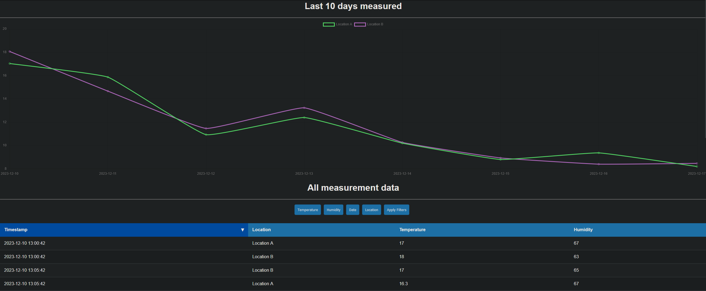

# TempMonitor

<p align="center">
  
</p>

## Inhaltverzeichnis

## 1. Einleitung

Das Tempmonitor-Projekt ist eine Implementierung eines Webservers, der als API-Endpunkt zum Senden von Temperatur- 
und Feuchtigkeitsdaten von einem ESP32-Mikrocontroller dient.Der Mikrocontroller verwendet einen Sensor, um die Temperaturdaten zu lesen und führt dann API-Aufrufe an den Webserver aus,
um die Daten in einen SQL-Server zu schreiben und sie dann visuell auf der Webseite darzustellen. Diese Readme-Datei dient als Dokumentation des Prozesses der Konfiguration des Servers, der Installation der notwendigen Software zum Betrieb des Servers, der Programmierung des Backends mit dem Flask-Framework, der Programmierung des Mikrocontrollers zum 
Lesen und Senden der Daten und der Programmierung des Frontends für die visuelle Darstellung der Daten.

## 2. Server Konfiguration
Der erste Schritt bestand darin, einen virtuellen Server bei einem Hosting-Anbieter zu mieten. Wir wurden angewiesen, den Server mit der geringsten RAM- und Festplattenkapazität zu wählen, da das Projekt nicht viel von diesen Ressourcen benötigt.

Der von mir gewählte virtuelle Server hat die folgenden Eigenschaften:
<table>
  <tr>
    <th>Host</th>
    <td> <a href="https://www.ionos.de/">IONOS</a> </td>
  </tr>
  <tr>
    <th>Betriebssystem</th>
    <td>Ubuntu 22.04</td>
  </tr>
  <tr>
    <th>CPU</th>
    <td>1 vCore</td>
  </tr>
  <tr>
    <th>RAM</th>
    <td>1 GB</td>
  </tr>
  <tr>
    <th>Datenträger</th>
    <td>10 GB SSD</td>
  </tr>
</table>

Nachdem die Anmietung abgeschlossen war, erhielt ich die Root-Benutzeranmeldeinformationen für meinen V-Server.

### 2.1 Benutzer-Konfiguration
Der Serveranbieter stellte mir ein SSH-Passwort für den Root-Benutzer zur Verfügung. Da die Kennwortauthentifizierung anfällig für Brute-Force-Angriffe ist, wurden wir angewiesen, einen Linux-Benutzer zu erstellen, der sich über eine schlüsselbasierte Authentifizierung beim Server anmelden kann.

Um dies zu erreichen, muss ich mich zunächst mit den Anmeldedaten am Server per SSH anmelden:  
```Console
pinghero@alex-desktop:~$ ssh root@server-ip
```
Nach Eingabe des Passworts in die Eingabeaufforderung habe ich mich erfolgreich mit dem Server verbunden.

### 2.1.1 Neuen Benutzer anlegen
Nach erfolgreicher Verbindung zum Server musste ein neuer Benutzer angelegt werden.  
Dies kann mit folgendem Linux-Befehl erreicht werden:
```Console
root@ubuntu:~$ adduser <username>
```
Nachdem der Befehl ausgeführt wurde, wurde ich aufgefordert, ein Benutzerpassword zu erstellen. Danach wurde der neue Benutzer erstellt.

Damit der neue Benutzer administrative Befehle auf dem Server ausführen kann, benötigt er sudo-Rechte. Zu diesem Zweck musste ich den Benutzer zur sudo-Benutzergruppe hinzufügen. Dazu führe ich den Befehl aus:
```Console
root@ubuntu:~$ usermod -aG sudo <username>
```

Und um zum neuen Benutzer zu wechseln, führe ich ```su - <username>```.